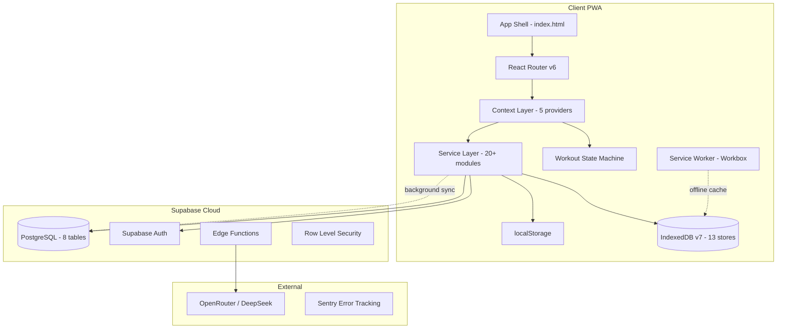
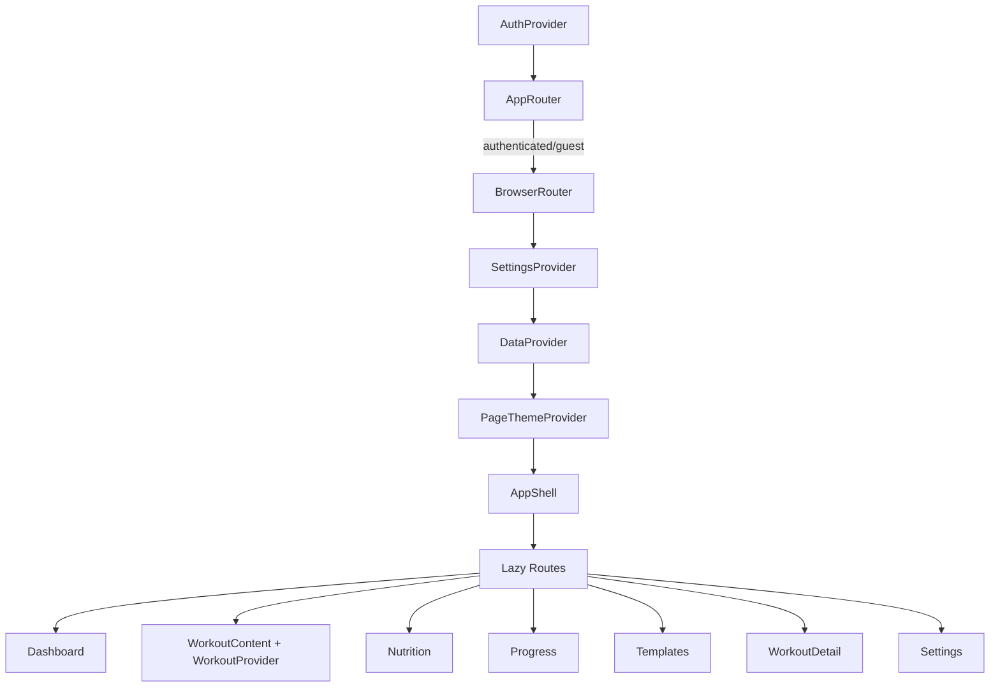
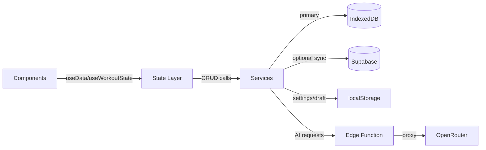
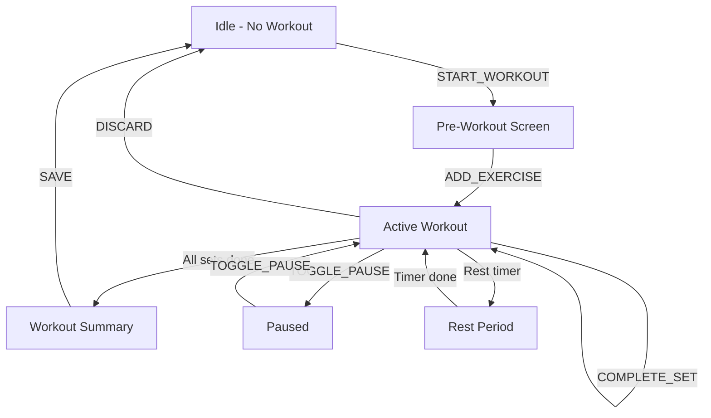

# SparkOS Fitness — Master Architecture Review (Full Codebase)

> **Date:** 2026-05-28
> **Scope:** Every file in the codebase (~200+ source files, ~50,000+ lines)
> **Method:** 9 parallel deep-dive sub-agent reviews covering all domains
> **Stack:** React 18 + TypeScript 5.3 + Vite 5 + TailwindCSS 3.4 + Supabase + IndexedDB v7

---

## Executive Summary

SparkOS Fitness is a **feature-rich offline-first PWA** with a Hebrew/RTL fitness tracking experience. The codebase demonstrates strong architectural instincts (offline-first IDB, split workout contexts, lazy loading, AI provider abstraction) but suffers from **significant code quality debt** accumulated through rapid feature development.

**Overall Grade: B- (72/100)**

| Domain | Grade | Key Issue |
|--------|-------|-----------|
| Architecture | B+ | Solid patterns, but god components and tight coupling |
| Type Safety | C+ | Strict mode disabled, 25+ optional fields per type |
| Code Quality | C | Massive files, duplication, dead code |
| Test Coverage | D+ | 12.5% file coverage, zero page/component tests |
| Security | B- | API key exposure in client bundle |
| Performance | B | Good lazy loading, but 681KB main bundle |
| Design System | A- | Excellent token system, WCAG AA compliant |
| Documentation | A | Exceptional CODEMAP, handoff docs |
| CI/CD | B- | Good pipeline, missing coverage thresholds |
| Supabase | B+ | Well-designed schema, no conflict resolution |

---

## Critical Findings (P0 — Must Fix)

### 1. API Key Exposed in Client Bundle
- **File:** [`src/services/ai/bootstrap.ts`](src/services/ai/bootstrap.ts:17)
- **Issue:** `VITE_DEEPSEEK_API_KEY` is a Vite env var, meaning it's bundled into the client JavaScript. Anyone can inspect the bundle and extract the API key.
- **Impact:** Financial — unauthorized API usage
- **Fix:** Remove client-side API key; route all AI calls through the Supabase Edge Function

### 2. Reducer Routing Bugs — Silent Fallback
- **File:** [`src/components/workout/core/workoutReducer.ts`](src/components/workout/core/workoutReducer.ts:719)
- **Issue:** `TOGGLE_PAUSE` and 4 modal actions are missing from their routing Sets, causing them to silently fall through to a fallback that runs ALL 6 sub-reducers on every dispatch
- **Impact:** Performance — every action triggers 6 reducer calls instead of 1
- **Fix:** Add missing actions to their respective routing Sets

### 3. `recoveryService.ts` is 278 Lines of Dead Code
- **File:** [`src/services/recoveryService.ts`](src/services/recoveryService.ts:1)
- **Issue:** Entirely unused — `bodyStatsService.ts` has its own recovery implementation
- **Impact:** Confusion, maintenance burden
- **Fix:** Delete immediately

### 4. CSS Duplication — 2,500 Lines of Duplicate Definitions
- **Files:** [`src/styles/global.css`](src/styles/global.css:1) (1211 lines) + [`src/styles/components.css`](src/styles/components.css:1) (1272 lines)
- **Issue:** `.card`, `.btn-primary`, `.glass`, `.badge`, `.input`, `@keyframes shimmer`, `@keyframes spin` are all defined TWICE with different values
- **Impact:** Unpredictable styling, maintenance nightmare
- **Fix:** Consolidate into a single CSS file or use Tailwind exclusively

### 5. Model Mismatch Between Client and Edge Function
- **Files:** [`src/services/ai/config.ts`](src/services/ai/config.ts:32) vs [`supabase/functions/ai-chat/index.ts`](supabase/functions/ai-chat/index.ts:37)
- **Issue:** Client requests `deepseek-v4-flash` but Edge Function's `ALLOWED_MODELS` only has OpenRouter models — silently replaced with default
- **Impact:** Users never get the model they think they're getting
- **Fix:** Sync model lists or use Edge Function as single source of truth

---

## High-Priority Findings (P1)

### 6. God Components — Massive Files Violating SRP

| File | Lines | Inline Components | Should Be |
|------|-------|-------------------|-----------|
| [`Progress.tsx`](src/pages/Progress.tsx) | 3,259 | 12 inline components | 8+ separate files |
| [`Login.tsx`](src/pages/Login.tsx) | 1,692 | 4 inline UI primitives | Extract to `components/ui/` |
| [`Settings.tsx`](src/pages/Settings.tsx) | 2,001 | 7 inline primitives | Extract to `components/ui/` |
| [`ActiveWorkoutNew.tsx`](src/components/workout/ActiveWorkoutNew.tsx) | 1,401 | 40+ useCallback handlers | Extract hooks |
| [`workoutDb.ts`](src/services/workoutDb.ts) | ~1,100 | 4 CRUD domains | Split into 4 files |
| [`supabaseSync.ts`](src/services/supabaseSync.ts) | 1,312 | 190 lines of duplicate interfaces | Extract shared types |
| [`WorkoutSummary.tsx`](src/components/workout/WorkoutSummary.tsx) | 721 | Stats + exercise list + PRs | Split into 3 components |
| [`analyticsService.ts`](src/services/analyticsService.ts) | 857 | All analytics in one file | Split by domain |

### 7. Type System Weakness
- **File:** [`src/types/index.ts`](src/types/index.ts:120) (533 lines)
- **Issue:** 5 overlapping types (`Exercise`, `PersonalExercise`, `PersonalItem`, `WorkoutExercise`, `WorkoutTemplateExercise`) with 60%+ field duplication
- **Issue:** `Exercise` type has 25+ optional fields — impossible to know which are populated in any given context
- **Issue:** `WorkoutSettings` is a 50-field monolith
- **Issue:** `Screen` type contains values from an unrelated project (`passwords`, `investments`, `logos`)

### 8. Duplicate Code Across Services
| Utility | Duplicated In |
|---------|--------------|
| `todayStr()` | 3 files |
| `generateId()` | 3 files |
| `formatDuration()` | 4 files |
| `formatDate()` | 3 files |
| Volume computation (`reps * weight`) | 4 files |
| `DumbbellIcon` SVG | 2 files |
| `buildSmoothPath()` | 2 chart components |

### 9. Test Coverage Crisis
- **15 test files** for ~120 source files (12.5%)
- **Zero tests** for: all pages, all components, all hooks, all context providers, cloud sync
- Tests that exist are high quality (7/10) but cover only utilities and simple services

### 10. Z-Index Conflict
- **Files:** [`src/constants/zIndex.ts`](src/constants/zIndex.ts) (JS: modal=1100) vs [`src/styles/tokens.css`](src/styles/tokens.css) (CSS: modal=90)
- **Impact:** Potential layering bugs when JS and CSS z-index values interact

---

## Medium-Priority Findings (P2)

### 11. `workoutDb.ts` vs `workoutService.ts` — Near-Identical Duplicates
Both files implement template CRUD with slightly different signatures. Components import from `dataService.ts` (the "public seam") which re-exports from `workoutDb.ts`, but `DataContext` imports from `workoutService.ts`.

### 12. DataContext Loads Everything on Mount
- **File:** [`src/contexts/DataContext.tsx`](src/contexts/DataContext.tsx:87)
- **Issue:** `Promise.all` loads all exercises, sessions (100), and templates on every mount
- **Impact:** Slow initial load as data grows

### 13. Three-Context Split Partially Defeated
- Hooks like `useCurrentExercise()`, `useWorkoutSettings()`, `useRestTimer()` subscribe to full state without memoization, causing unnecessary re-renders

### 14. `workoutSelectors.ts` is Entirely Unused
- **File:** [`src/components/workout/core/workoutSelectors.ts`](src/components/workout/core/workoutSelectors.ts)
- **Issue:** Contains pure selector functions that are never imported — `WorkoutProvider.tsx` reimplements the same logic inline

### 15. No Hydration Schema Versioning
- Active workout state saved to `localStorage.active_workout_v3_state` has no migration path for stale saved states

### 16. Supabase Sync — No Conflict Resolution
- **File:** [`src/services/supabaseSync.ts`](src/services/supabaseSync.ts)
- **Issue:** Uses last-write-wins with no `updated_at` comparison
- **Impact:** Multi-device sync can lose data

### 17. Offline Queue Not Actually Used
- **File:** [`src/services/offlineQueue.ts`](src/services/offlineQueue.ts)
- **Issue:** Well-designed but no domain service actually uses it — they all use the weaker `syncWithRetry` pattern

### 18. Dual Haptic Systems
- **Files:** [`src/utils/haptics.ts`](src/utils/haptics.ts) + [`src/hooks/useHaptics.ts`](src/hooks/useHaptics.ts)
- **Issue:** Two separate implementations of haptic feedback

### 19. Triple Button Components
- **Files:** `Button.tsx`, `AccessibleButton` (in Login.tsx), `FSButton` (in OnboardingFlow.tsx)
- **Issue:** Three different button components with different variant systems

### 20. PWA Manifest Issues
- Invalid `"any maskable"` purpose value
- Duplicate icon entry
- Theme color mismatch between manifest and HTML
- Placeholder URLs in robots.txt and sitemap.xml

---

## Low-Priority Findings (P3)

### 21. PageThemeContext is a No-Op
All 6 content pages use the identical `#43C7A5` accent color — the per-route theming system is configured but doesn't actually differentiate.

### 22. Legacy CSS Aliases
`--bone`, `--navy`, `--mustard` tokens are duplicated across light/dark mode blocks in tokens.css — legacy from an earlier design system.

### 23. Double Google Fonts Loading
CSS `@import` + HTML `<link>` both load the same fonts — redundant network requests.

### 24. Global Heading `text-transform: uppercase`
Applied aggressively to all `h1-h6` in global.css — may not be desirable for all contexts.

### 25. Hebrew Strings Hardcoded in Components
No i18n system — Hebrew strings are scattered across 100+ component files.

### 26. Backup File in Repo
`src/services/workoutDb.ts.bak` — should be in `.gitignore` or deleted.

### 27. Duplicate `'Traps'` Entries
[`src/data/builtInExercises.ts`](src/data/builtInExercises.ts:319) has duplicate entries for Traps at lines 319 and 331.

### 28. `AnimatedProgressRing` Shows `§` Instead of Checkmark
Completion badge displays wrong character.

### 29. `useSwipeGesture` Touch Bug
Uses `e.touches[0]` in `handleTouchEnd` instead of `e.changedTouches[0]` — may return wrong coordinates.

### 30. `useInputFocus` Creates New Ref Every Render
[`src/hooks/useMobileKeyboard.ts`](src/hooks/useMobileKeyboard.ts:143) — `useRef` called inside a conditional, creating a new ref object on every render.

---

## Architecture Diagrams

### System Overview

### Provider Tree

### Data Flow

### Workout State Machine

---

## Recommended Action Plan

### Phase 1: Critical Fixes (Immediate)
1. Remove client-side API key from `bootstrap.ts`
2. Fix reducer routing bugs (missing actions in Sets)
3. Delete `recoveryService.ts` (dead code)
4. Sync model lists between client and Edge Function
5. Fix PWA manifest (invalid purpose, duplicate icon, placeholder URLs)
6. Delete `workoutDb.ts.bak`

### Phase 2: Type Safety & Code Quality (Short-term)
7. Enable TypeScript strict mode and fix type errors
8. Consolidate CSS — remove duplicate definitions
9. Extract shared utilities (`todayStr`, `generateId`, `formatDuration`, volume computation)
10. Consolidate button components into single `Button.tsx`
11. Consolidate haptic systems into single implementation
12. Fix `workoutSelectors.ts` — either use it or delete it

### Phase 3: File Splitting (Medium-term)
13. Split `Progress.tsx` into 8+ files
14. Split `ActiveWorkoutNew.tsx` — extract `useWorkoutSave`, `useSupersetMode`, `useExerciseSuggestions` hooks
15. Split `workoutDb.ts` into `templateDb.ts`, `sessionDb.ts`, `exerciseDb.ts`
16. Split `supabaseSync.ts` — extract shared types
17. Split `analyticsService.ts` by domain
18. Extract inline UI primitives from Login/Settings/OnboardingFlow

### Phase 4: Test Coverage (Medium-term)
19. Add tests for DataContext, AuthContext, SettingsContext
20. Add tests for workout reducer (all action types)
21. Add tests for critical service paths (cloud sync, offline queue)
22. Add tests for page components (at least smoke tests)
23. Add coverage thresholds to CI pipeline

### Phase 5: Architecture Improvements (Long-term)
24. Unify ID generation to UUIDs everywhere
25. Add pagination to DataContext
26. Implement conflict resolution for Supabase sync
27. Wire up offline queue to domain services
28. Add proper i18n system for Hebrew strings
29. Implement hydration schema versioning for workout state
30. Add E2E tests with Playwright

---

## Detailed Review Files

| # | Review File | Domain | Files Reviewed |
|---|------------|--------|----------------|
| 1 | [`review-01-core-entry.md`](review-01-core-entry.md) | Core, Entry, Types, Constants, Errors, CSS | 16 |
| 2 | [`review-02-contexts-state.md`](review-02-contexts-state.md) | Contexts, Workout State Engine | 13 |
| 3 | [`review-03-services-data.md`](review-03-services-data.md) | Services: Data & Storage | 12 |
| 4 | [`review-04-services-domain.md`](review-04-services-domain.md) | Services: Domain Layer | 11 |
| 5 | [`review-05-services-ai.md`](review-05-services-ai.md) | Services: AI Layer | 12 |
| 6 | [`review-06-pages.md`](review-06-pages.md) | Pages | 9 |
| 7 | [`review-07-workout-components.md`](review-07-workout-components.md) | Workout Components | 57 |
| 8 | [`review-08-ui-hooks-utils-data.md`](review-08-ui-hooks-utils-data.md) | UI, Hooks, Utils, Data | 72 |
| 9 | [`review-09-tests-infra-config.md`](review-09-tests-infra-config.md) | Tests, CI/CD, Migrations, Config | 30 |

**Total: ~222 files reviewed across 9 parallel deep-dive analyses.**

---

## Strengths Worth Preserving

1. **Offline-first architecture** — IndexedDB as primary store with Supabase optional sync is the right pattern for a fitness app
2. **Workout state machine isolation** — Separate context tree, only mounted during `/workout`, prevents global re-renders
3. **Design system maturity** — 5-layer CSS architecture with ~140 tokens, WCAG AA contrast, RTL-native
4. **Lazy loading discipline** — All pages + heavy workout overlays are `React.lazy()`
5. **AI provider abstraction** — Edge Function with model allowlist and cost control
6. **Documentation quality** — CODEMAP.md, AI_INTEGRATION.md, SUPABASE_SYNC_HANDOFF.md are exceptional
7. **Chart components** — All 5 production charts are excellent quality
8. **Hook cleanup patterns** — Timers, event listeners, and animations are consistently cleaned up
9. **Supabase schema** — Well-designed with comprehensive RLS, optimized auth.uid() pattern, proper indexes
10. **Hebrew/RTL support** — Consistent `dir="rtl"`, logical CSS properties, proper number handling
