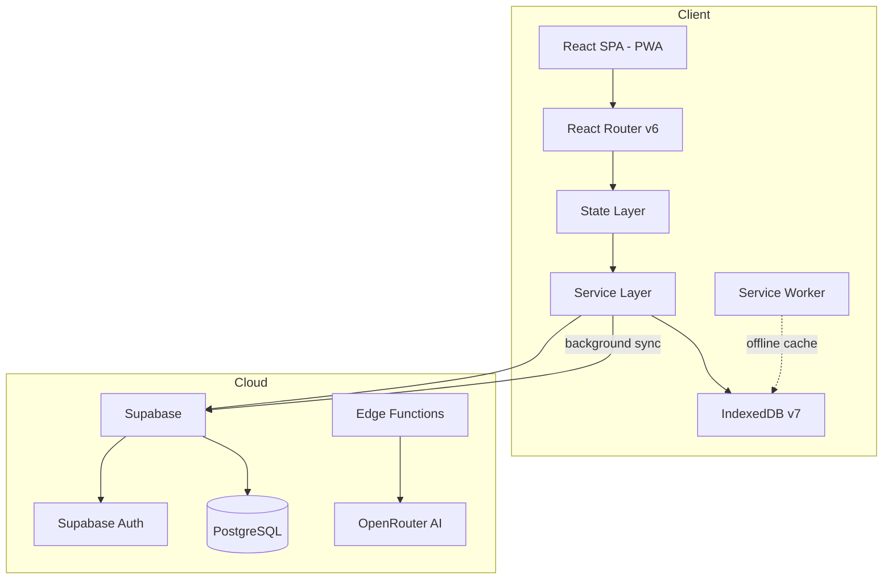
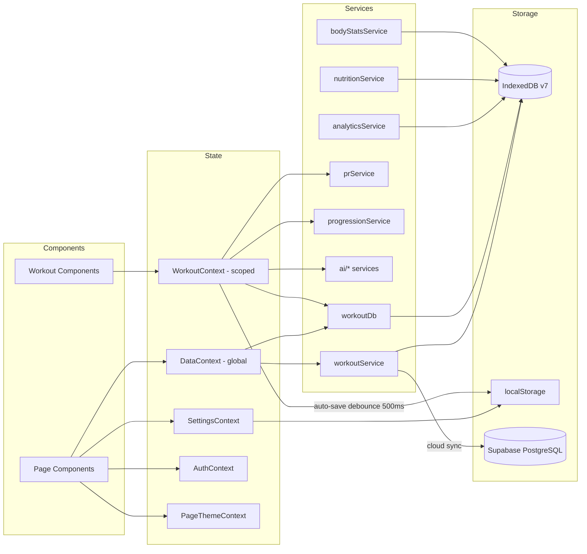
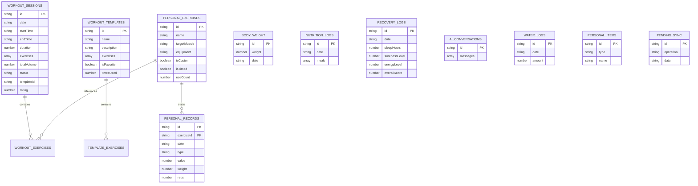
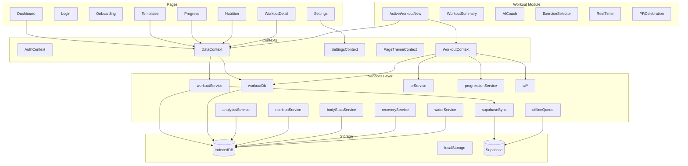

# SparkOS Fitness — Architecture Review

> **Date:** 2026-05-27
> **Scope:** Full-stack architecture review of the SparkOS Fitness PWA
> **Stack:** React 18 + TypeScript 5.3 + Vite 5 + TailwindCSS 3.4 + Supabase

---

## 1. High-Level Architecture Overview



---

## 2. Provider / Rendering Tree

```mermaid
graph TD
    A[AuthProvider] --> B[AppRouter]
    B -->|authenticated| C[BrowserRouter]
    B -->|unauthenticated| L[Login]
    B -->|first run| O[OnboardingFlow]
    C --> D[SettingsProvider]
    D --> E[DataProvider]
    E --> F[PageThemeProvider]
    F --> G[AppShell]
    G --> H[Routes - lazy loaded]
    G --> I[BottomNav]
    H --> H1[/ - Dashboard]
    H --> H2[/workout - WorkoutContent]
    H --> H3[/nutrition - Nutrition]
    H --> H4[/progress - Progress]
    H --> H5[/templates - Templates]
    H --> H6[/history/:id - WorkoutDetail]
    H --> H7[/settings - Settings]
    H2 --> J[WorkoutProvider]
    J --> K[WorkoutStateContext]
    J --> KK[WorkoutDispatchContext]
    J --> KL[WorkoutDerivedContext]
```

---

## 3. Data Flow Architecture



---

## 4. IndexedDB Schema (v7)



---

## 5. Strengths

### 5.1 Solid Foundation
- **Well-structured lazy loading** — All pages are code-split via `React.lazy()`, including the heavy workout module
- **Comprehensive type system** — `src/types/index.ts` (533 lines) provides thorough TypeScript types for all domain entities
- **Documented codebase** — `CODEMAP.md` (543 lines) is an excellent onboarding document with line-by-line file descriptions
- **Design system maturity** — `DESIGN_SYSTEM.md` defines a 5-layer design architecture with clear token hierarchy, WCAG AA contrast requirements, and typography scale

### 5.2 Smart State Design
- **Workout state machine** is isolated from global state — mounted only during `/workout`, using three split contexts (`State`, `Dispatch`, `Derived`) for performance
- **Reducer slicing** — The workout reducer is split into 6 slices (`exercise`, `set`, `timer`, `ui`, `modal`, `data`) routed by action-type → slice `Set` map
- **Auto-save with debounce** — 500ms debounced save + 30s backup + `visibilitychange`/`beforeunload` save prevents data loss

### 5.3 Offline-First Architecture
- **IndexedDB as primary store** with Supabase as optional cloud sync
- **Offline queue** (`offlineQueue.ts`) with `initOfflineSync()` called once from App.tsx
- **PWA support** via `vite-plugin-pwa` with Workbox runtime caching

### 5.4 AI Integration
- **Provider-agnostic AI** — Edge function abstracts the AI provider (OpenRouter), with model allowlist for cost control
- **Centralized persona** — Single `AI_PERSONA` constant in `ai/config.ts` with Hebrew persona
- **Context builder** — Dedicated `contextBuilder.ts` for assembling workout context for AI

---

## 6. Issues & Risks

### 6.1 Critical Issues

#### 6.1.1 Giant Files — Single Responsibility Violation
| File | Lines | Problem |
|------|-------|---------|
| `ActiveWorkoutNew.tsx` | ~1200 | Orchestrator that composes ALL workout UI, overlays, hooks, and effects |
| `WorkoutSummary.tsx` | ~972 | Stats, exercise list, PR highlights all in one file |
| `workoutDb.ts` | ~1100 | Sessions, templates, exercises, body weight CRUD all in one file |
| `analyticsService.ts` | ~857 | All analytics functions in one file |
| `App.tsx` | ~512 | Router + auth gate + onboarding gate + shell + providers |

These files are difficult to test, maintain, and refactor. The ROADMAP already identifies this as Priority 1.3.

#### 6.1.2 `Exercise` Type Has Too Many Optional Fields
The [`Exercise`](src/types/index.ts:120) type has 25+ fields, many optional and overlapping with [`WorkoutExercise`](src/types/index.ts:29) and [`PersonalExercise`](src/types/index.ts:153). This leads to:
- Confusion about which fields are populated in which context
- Defensive coding with `?.` everywhere
- Backward-compatibility aliases like `name?: string` alongside `exerciseName`

#### 6.1.3 Dual ID Systems
The project uses both UUID (Supabase) and timestamp-based IDs (`template-${Date.now()}`) for local entities. This creates potential collision issues and complicates the sync layer.

### 6.2 Architectural Concerns

#### 6.2.1 No Clear Service Interface Layer
Services mix concerns:
- [`workoutService.ts`](src/services/workoutService.ts) handles both CRUD AND cloud sync (with retry logic embedded)
- [`dataService.ts`](src/services/dataService.ts) is described as the "public seam" but is just re-exports + one init function
- No dependency injection — services directly import each other, making testing harder

#### 6.2.2 Global Context Bloat Risk
[`DataContext`](src/contexts/DataContext.tsx) loads ALL data on mount (exercises, sessions, templates, personal items) via `Promise.all`. As data grows:
- Initial load time will increase
- Any data change triggers a full `refreshData()` call
- No pagination or virtual scrolling for large datasets

#### 6.2.3 TypeScript Strict Mode Disabled
The ROADMAP notes `strict: true` is not enabled, with 30+ type errors. This undermines the type system's value and allows `any` to leak through.

#### 6.2.4 Test Coverage Gaps
Only 11 test files exist:
- `services/__tests__/` — 7 files (only covers 7 of ~20+ services)
- `src/test/` — 4 files (RootErrorBoundary, webVitals, no-emoji, setup)
- No tests for: contexts, hooks, pages, workout components, UI components
- No E2E tests configured

#### 6.2.5 localStorage Dependency for Critical State
Multiple critical features rely on `localStorage`:
- Onboarding completion: `onboarding_completed`
- User profile: `user_profile`
- Active workout state: `active_workout_v3_state`
- App settings: `appSettings`

localStorage has a ~5MB limit and no encryption. The active workout state alone could be substantial with many exercises.

### 6.3 Performance Concerns

#### 6.3.1 Bundle Size
The ROADMAP mentions the main bundle is 681KB with a target of <300KB. While pages are lazy-loaded, the shell (App.tsx + contexts + providers + BottomNav) is eager-loaded.

#### 6.3.2 WorkoutContext Derived Values
The `WorkoutDerivedContext` computes memoized totals on every state change. With complex workouts (10+ exercises, 5+ sets each), this could cause noticeable re-renders.

#### 6.3.3 No Virtualization for Long Lists
While `@tanstack/react-virtual` is installed as a dependency, it needs to be verified that it's actually used for session history, exercise lists, and other potentially long lists.

### 6.4 Security Concerns

#### 6.4.1 AI Edge Function Model Allowlist
The edge function has a model allowlist, which is good. However:
- The `ALLOWED_ORIGIN` CORS config relies on env var — needs verification it's properly set
- No rate limiting beyond Supabase's built-in limits
- No token/cost budget per user

#### 6.4.2 No Data Encryption at Rest
IndexedDB data (including personal health data like weight, body measurements) is stored unencrypted. For a fitness app this is generally acceptable, but worth noting.

---

## 7. Recommendations

### 7.1 Immediate (P0) — Foundation

| # | Recommendation | Impact | Effort |
|---|---------------|--------|--------|
| 1 | **Enable TypeScript strict mode** and fix type errors | Prevents runtime bugs, improves DX | Medium |
| 2 | **Split giant files** — `workoutDb.ts` → `templateDb.ts` + `sessionDb.ts` + `exerciseDb.ts` | Maintainability, testability | Medium |
| 3 | **Split `ActiveWorkoutNew.tsx`** into smaller composed components | Maintainability | Medium |
| 4 | **Unify ID generation** — always use UUID v4 for new entities | Prevents sync conflicts | Low |
| 5 | **Add tests for critical paths** — DataContext, workout reducer, core services | Prevents regressions | High |

### 7.2 Short-Term (P1) — Architecture Improvements

| # | Recommendation | Impact | Effort |
|---|---------------|--------|--------|
| 6 | **Introduce service interfaces** — Define TypeScript interfaces for each service, inject via context | Testability, decoupling | Medium |
| 7 | **Add pagination to DataContext** — Load recent data first, paginate older data | Performance, scalability | Medium |
| 8 | **Separate sync from CRUD** — Move cloud sync logic out of service files into dedicated sync layer | Separation of concerns | Medium |
| 9 | **Add error reporting integration** — Sentry is installed but needs proper integration | Observability | Low |
| 10 | **Consolidate type aliases** — Remove backward-compat aliases (`name` vs `exerciseName`), clean up `Exercise` type | Code clarity | Low |

### 7.3 Medium-Term (P2) — Feature Architecture

| # | Recommendation | Impact | Effort |
|---|---------------|--------|--------|
| 11 | **Implement proper data layer pattern** — Repository pattern with IndexedDB adapter | Architecture cleanliness | High |
| 12 | **Add E2E tests** with Playwright | Confidence in releases | High |
| 13 | **Implement conflict resolution** for multi-device sync | Data integrity | High |
| 14 | **Add monitoring/analytics** — Track feature usage, error rates, performance metrics | Product insights | Medium |
| 15 | **Progressive data loading** — Skeleton → cached → fresh pattern for all pages | Perceived performance | Medium |

---

## 8. Current Architecture Diagram — Component Dependency Map



---

## 9. Summary

The SparkOS Fitness app has a **solid architectural foundation** with smart design decisions:
- Offline-first with IndexedDB as primary storage
- Isolated workout state machine with performance-optimized split contexts
- Comprehensive design system with WCAG AA compliance
- Lazy loading and code splitting for all pages
- AI integration with provider abstraction and cost controls

The **main risks** are:
1. **Giant files** that violate single responsibility and hinder testing/maintenance
2. **Type safety gaps** — strict mode disabled, overly permissive type definitions
3. **No test coverage** for critical user-facing paths (contexts, pages, workout flow)
4. **Tight coupling** between services and storage (no repository/interface abstraction)
5. **Data scalability** — DataContext loads everything on mount with no pagination

The **recommended priority** is: strict mode → file splitting → test coverage → service layer abstraction → pagination.
