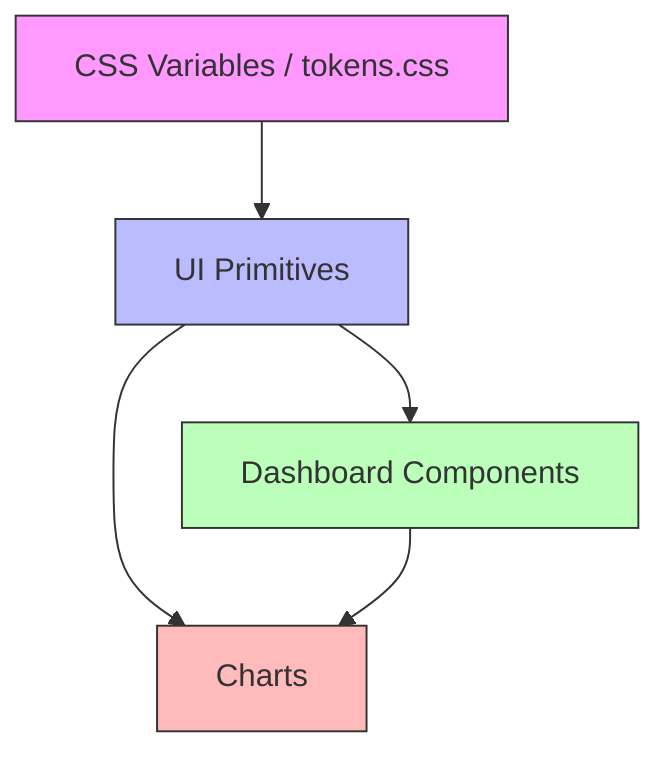
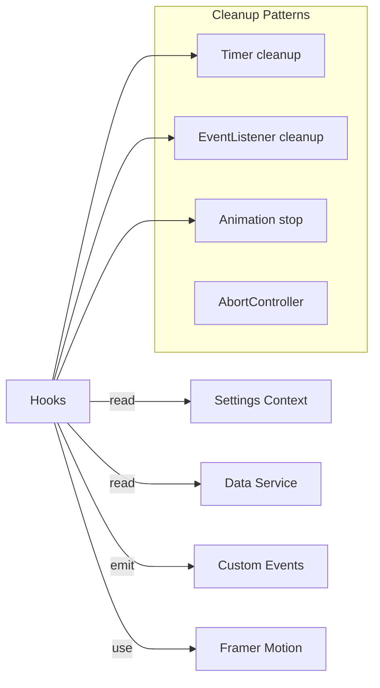

# Review 08 — UI Primitives, Dashboard Components, Charts, Hooks, Utils & Data Files

**Scope:** 72 files across `src/components/ui/`, `src/components/dashboard/`, `src/components/charts/`, `src/components/animations/`, `src/components/fitness/`, `src/components/nutrition/`, `src/hooks/`, `src/utils/`, and `src/data/`  
**Date:** 2026-05-28  
**Status:** Deep-dive review — UI layer, behavioral hooks, utility functions, and static data

---

## Table of Contents

1. [UI Primitives (23 files)](#1-ui-primitives)
2. [Dashboard Components (13 files)](#2-dashboard-components)
3. [Charts (6 files)](#3-charts)
4. [Other Components (4 files)](#4-other-components)
5. [Global Hooks (11 files)](#5-global-hooks)
6. [Utilities (13 files)](#6-utilities)
7. [Data Files (2 files)](#7-data-files)
8. [Cross-Cutting Analysis](#8-cross-cutting-analysis)
9. [Recommendations Summary](#9-recommendations-summary)

---

## 1. UI Primitives

### Overview

The `src/components/ui/` directory contains 23 files forming the foundational design system. The "Fresh Steel" / "Sport Annual" design language uses a navy-mustard-bone palette with sharp (border-radius: 0) editorial aesthetics, CSS variable-driven theming, and framer-motion for animations.

### File-by-File Analysis

#### 1.1 [`Accessible.tsx`](src/components/ui/Accessible.tsx) — 703 lines

**Purpose:** Comprehensive accessibility toolkit — `AccessibleButton`, `AccessibleInput`, `AccessibleModal`, `SkipLink`, `VisuallyHidden`, `LiveRegion`, `FocusTrap`, `AccessibleTabs`.

**Quality: ✅ Excellent**
- Proper ARIA attributes (`aria-busy`, `aria-disabled`, `aria-modal`, `aria-labelledby`, `aria-describedby`)
- Focus management with `previousActiveElement` restoration
- Keyboard navigation for tabs (ArrowLeft/Right, Home, End)
- `useId()` for stable ID generation
- Hebrew default labels (e.g., `loadingText = 'טוען...'`)

**Issues:**
- **Duplicate focus trap logic** — `FocusTrap` component here duplicates functionality already in [`useFocusTrap`](src/hooks/useFocusTrap.ts). The `AccessibleModal` also implements its own focus trapping inline. Three different focus trap implementations exist.
- **`AccessibleInput` RTL bug** — `leftAddon` is positioned with `right-3` and `rightAddon` with `left-3`, which appears to be RTL-aware but the CSS classes contradict the prop names.
- **Hardcoded Hebrew** — All default labels are Hebrew-only; no i18n support.

**Recommendations:**
- Consolidate focus trap logic: use [`useFocusTrap`](src/hooks/useFocusTrap.ts) in `AccessibleModal` instead of inline implementation.
- Remove the standalone `FocusTrap` component or alias it to the hook.

#### 1.2 [`AnimatedNumber.tsx`](src/components/ui/AnimatedNumber.tsx) — 156 lines

**Purpose:** Animated counter with spring physics and direction indicator. Also exports `AnimatedProgress` bar.

**Quality: ✅ Good**
- Proper cleanup in `useEffect` (stops animation, clears timeout)
- Memoized `format` function usage
- Direction arrow with framer-motion enter/exit

**Issues:**
- **`format` in dependency array** — If caller doesn't memoize `format`, the animation will restart on every render. Should document this requirement.
- **Dual export pattern** — Both named and default exports; the `AnimatedProgress` is only a named export.

**Recommendations:**
- Add JSDoc warning about memoizing the `format` prop.
- Consider splitting `AnimatedProgress` into its own file since it's a distinct component.

#### 1.3 [`AnimatedProgressRing.tsx`](src/components/ui/AnimatedProgressRing.tsx) — 249 lines

**Purpose:** Circular progress ring with confetti celebration at 100%.

**Quality: ✅ Good**
- Respects `prefers-reduced-motion` via framer-motion's `useReducedMotion()`
- Proper ARIA `progressbar` role
- Memoized confetti particles and gradient colors

**Issues:**
- **`Math.random()` in render** — `ConfettiParticle` uses `Math.random()` directly, which produces different values on each render. Should be memoized or computed once.
- **Completion badge uses `§` character** — The completion emoji is `§` (section sign) instead of a checkmark. Likely a placeholder or bug.
- **Duplicate progress ring** — This component overlaps significantly with [`RingProgress`](src/components/charts/RingProgress.tsx) in the charts directory.

**Recommendations:**
- Fix the completion badge to use an actual emoji or icon.
- Consolidate with `RingProgress` — one should be the primitive, the other should compose it.

#### 1.4 [`AuroraBackground.tsx`](src/components/ui/AuroraBackground.tsx) — 51 lines

**Purpose:** Decorative animated gradient background with grain overlay.

**Quality: ✅ Good**
- Lightweight, pure presentational
- Uses `pointer-events-none` correctly

**Issues:**
- **Always-running animations** — Three infinite animations run permanently regardless of visibility. Should pause when tab is not visible or use `IntersectionObserver`.
- **No `prefers-reduced-motion` check** — Decorative animations should respect user preferences.

**Recommendations:**
- Add `useReducedMotion` check to disable animations.
- Consider using CSS animations instead of framer-motion for better performance.

#### 1.5 [`BottomNav.tsx`](src/components/ui/BottomNav.tsx) — 137 lines

**Purpose:** Fixed bottom tab navigation with active pill indicator.

**Quality: ✅ Excellent**
- Proper `aria-label` and `aria-current="page"` for active tab
- Route prefetching on hover/touch
- Re-click on active tab scrolls to top and focuses main content
- `memo` wrapper for performance
- Keyboard support (Enter/Space on active tab)

**Issues:**
- **Hebrew-only labels** — No i18n support.
- **`contain: layout style paint`** — May cause issues with modals/popovers that need to escape the containment context.

**Recommendations:**
- Extract labels to a constants file for i18n readiness.

#### 1.6 [`Button.tsx`](src/components/ui/Button.tsx) — 227 lines

**Purpose:** Primary button with 8 variants (primary, secondary, ghost, glass, danger, pill, card-action, start).

**Quality: ⚠️ Fair**
- Good variant system with CSS variable theming
- Framer-motion hover/tap effects

**Issues:**
- **`biome-ignore lint/suspicious/noExplicitAny`** — Line 179 casts props to `any` due to framer-motion type conflicts. This suppresses type safety.
- **Inline `style` prop overrides** — The `card-action`, `start`, and `icon` variants use inline `style` objects that override className-based styles, creating specificity conflicts.
- **Duplicate button** — [`AccessibleButton`](src/components/ui/Accessible.tsx) and [`FSButton`](src/components/dashboard/TemplateQuickStart.tsx) both implement button components with different variant systems.
- **No `forwardRef`** — Cannot be used with tooltip/popover libraries that need ref forwarding.

**Recommendations:**
- Consolidate into a single `Button` component with all variants.
- Add `forwardRef` support.
- Resolve the framer-motion type conflict properly.

#### 1.7 [`EmptyState.tsx`](src/components/ui/EmptyState.tsx) — 546 lines

**Purpose:** Generic empty state with 10 SVG illustrations (tasks, habits, feed, search, calendar, notes, workout, success, error, generic).

**Quality: ⚠️ Fair**
- Good variety of illustrations
- CSS animation injection via `<style>` tag

**Issues:**
- **Inline `<style>` tag** — Injects CSS via JSX `<style>` element on every render. Should be in global CSS or use CSS modules.
- **SVG gradient ID collisions** — Each illustration uses hardcoded gradient IDs (e.g., `tasksGradient`). If two `EmptyState` components render simultaneously, IDs will collide.
- **546 lines for a simple component** — The bulk is inline SVGs. Should be extracted to separate files or a sprite sheet.
- **Inline button styles** — Uses `style={{}}` instead of the design system's `Button` component.

**Recommendations:**
- Extract SVG illustrations to a separate file.
- Use `useId()` for gradient IDs.
- Use the existing `Button` component for actions.

#### 1.8 [`index.tsx`](src/components/ui/index.tsx) — 34 lines

**Purpose:** Barrel exports for UI components.

**Quality: ✅ Good**
- Clean re-exports with both named and default patterns.

**Issues:**
- **Missing exports** — `EmptyState`, `WorkoutSkeletons`, `OfflineIndicator` are not exported from the barrel. Consumers must import directly.
- **Inconsistent export style** — Some use `export { default as X }`, others use named exports.

**Recommendations:**
- Add missing exports.
- Standardize on named exports throughout.

#### 1.9 [`Input.tsx`](src/components/ui/Input.tsx) — 123 lines

**Purpose:** Styled text input with label, error, helper, and icon support.

**Quality: ⚠️ Fair**
- `forwardRef` support
- Error animation with framer-motion

**Issues:**
- **`Math.random()` for ID generation** — Line 19: `Math.random().toString(36).substring(2, 11)`. Should use `useId()`.
- **Duplicate with `AccessibleInput`** — Both implement labeled inputs with error states.
- **No `aria-invalid` or `aria-describedby`** — Missing accessibility attributes that `AccessibleInput` has.

**Recommendations:**
- Replace `Math.random()` with `useId()`.
- Merge with `AccessibleInput` or clearly differentiate their use cases.

#### 1.10 [`label.tsx`](src/components/ui/label.tsx) — 21 lines

**Purpose:** Radix UI label re-export with styling.

**Quality: ✅ Good**
- Clean, minimal wrapper.
- Uses path alias `@/utils/styles`.

**Issues:**
- **Path alias inconsistency** — Uses `@/utils/styles` while all other files use relative paths `../../utils/styles`.

#### 1.11 [`LoadingSpinner.tsx`](src/components/ui/LoadingSpinner.tsx) — 327 lines

**Purpose:** 6 spinner variants (default, dots, pulse, orbit, gradient, wave).

**Quality: ✅ Good**
- Good variety of animations
- `role="status"` and `aria-live="polite"` for accessibility
- `sr-only` text for screen readers
- `React.memo` wrapper

**Issues:**
- **`ignoreSettings` prop unused** — The `ignoreSettings` prop is checked but the actual settings integration was removed. Dead logic.
- **Hebrew-only text** — Default `text = 'טוען...'`.

#### 1.12 [`LongPressMenu.tsx`](src/components/ui/LongPressMenu.tsx) — 346 lines

**Purpose:** Long-press contextual menu with haptic feedback, portal rendering, and spring animations.

**Quality: ✅ Excellent**
- Touch and mouse support
- Proper cleanup of timers on unmount
- Movement threshold detection (10px) to cancel long-press
- Portal rendering for z-index stacking
- Escape key and click-outside dismissal
- Staggered item animations

**Issues:**
- **`didLongPress` ref not reset on menu close** — If menu closes programmatically, the ref stays `true`, potentially blocking the next interaction.

**Recommendations:**
- Reset `didLongPress.current = false` in `closeMenu`.

#### 1.13 [`ModalOverlay.tsx`](src/components/ui/ModalOverlay.tsx) — 261 lines

**Purpose:** Reusable modal overlay with 4 variants (modal, bottomSheet, fullscreen, none), focus trapping, and scroll locking.

**Quality: ✅ Excellent**
- Comprehensive prop API (16 props)
- Uses [`useFocusTrap`](src/hooks/useFocusTrap.ts) hook
- Portal rendering
- `prefers-reduced-motion` support
- Proper ARIA attributes

**Issues:**
- **Redundant with `AccessibleModal`** — Two modal implementations exist. `ModalOverlay` is more feature-rich.

**Recommendations:**
- Deprecate `AccessibleModal` in favor of `ModalOverlay`.

#### 1.14 [`OfflineIndicator.tsx`](src/components/ui/OfflineIndicator.tsx) — 76 lines

**Purpose:** Shows online/offline status and pending sync queue depth.

**Quality: ✅ Good**
- Polls queue depth every 5 seconds
- Proper cleanup (`active` flag pattern)
- `role="status"` and `aria-live="polite"`

**Issues:**
- **Polling interval** — 5-second polling for queue depth is aggressive. Could use event-based updates.

#### 1.15 [`Premium3DCard.tsx`](src/components/ui/Premium3DCard.tsx) — 130 lines

**Purpose:** Mouse-tracking 3D tilt card with glare effect.

**Quality: ✅ Good**
- Smooth spring physics
- Proper `perspective` and `transform-style: preserve-3d`

**Issues:**
- **Mouse-only** — No touch support for mobile devices.
- **Performance** — Creates multiple motion values per card. Many cards on screen could be expensive.

#### 1.16 [`PremiumSelect.tsx`](src/components/ui/PremiumSelect.tsx) — 173 lines

**Purpose:** Custom select dropdown with framer-motion animations.

**Quality: ⚠️ Fair**
- Click-outside detection
- Keyboard-friendly (native button elements)

**Issues:**
- **No keyboard navigation** — Cannot navigate options with arrow keys.
- **No `aria-expanded`** — Missing ARIA attributes for the dropdown.
- **Hardcoded `mousedown`** — Should also handle `touchstart` for mobile.

#### 1.17 [`PullToRefresh.tsx`](src/components/ui/PullToRefresh.tsx) — 105 lines

**Purpose:** Pull-to-refresh wrapper with ring progress indicator.

**Quality: ✅ Good**
- Clean composition with [`usePullToRefresh`](src/hooks/usePullToRefresh.ts)
- SVG ring progress visualization

#### 1.18 [`SkeletonLoader.tsx`](src/components/ui/SkeletonLoader.tsx) — 756 lines

**Purpose:** Comprehensive skeleton loader system with 20+ skeleton templates for every screen.

**Quality: ⚠️ Fair**
- Extensive coverage of all screens
- Uses `.premium-shimmer` CSS class

**Issues:**
- **756 lines** — Extremely large file. Should be split into per-screen files.
- **`Math.random()` in render** — `SkeletonCalendarGrid` uses `Math.random()` to conditionally render dots.
- **`screenSkeletonMap` uses `Screen` type** — References a `Screen` type that may not cover all routes.
- **Legacy export** — `SkeletonLoader` at the bottom is just `SkeletonList`.

**Recommendations:**
- Split into `skeletons/HomeScreen.tsx`, `skeletons/WorkoutScreen.tsx`, etc.
- Fix `Math.random()` usage.

#### 1.19 [`SmoothLoader.tsx`](src/components/ui/SmoothLoader.tsx) — 237 lines

**Purpose:** Cross-fade from skeleton to content with minimum display time. Also exports `InlineLoader` and `ErrorWithRetry`.

**Quality: ✅ Good**
- Prevents skeleton flash with `minSkeletonTime`
- Clean `AnimatePresence` usage

**Issues:**
- **`ErrorWithRetry` in same file** — Different component, should be separated.

#### 1.20 [`Toast.tsx`](src/components/ui/Toast.tsx) — 245 lines

**Purpose:** Toast notification with auto-dismiss, undo action, and progress bar.

**Quality: ✅ Good**
- Proper exit animation with `onExitComplete`
- Progress bar animation
- Undo support

**Issues:**
- **`eslint-disable react-hooks/exhaustive-deps`** — Line 91 suppresses the exhaustive deps lint rule. The `triggerExit` function is used inside the effect but not in the dependency array.

#### 1.21 [`ToggleSwitch.tsx`](src/components/ui/ToggleSwitch.tsx) — 158 lines

**Purpose:** Accessible toggle switch with 3 sizes.

**Quality: ✅ Excellent**
- Proper `role="switch"` and `aria-checked`
- Keyboard support (Enter/Space)
- Haptic feedback on toggle
- `useId()` for stable IDs
- `React.memo` wrapper

#### 1.22 [`UltraCard.tsx`](src/components/ui/UltraCard.tsx) — 178 lines

**Purpose:** Card component with 4 variants and optional cursor glow effect.

**Quality: ✅ Good**
- Theme-aware CSS variables
- Compound component pattern (`UltraCard`, `UltraCardHeader`, `UltraCardBody`, `UltraCardFooter`)

**Issues:**
- **Legacy `glowColor` prop** — Accepted but intentionally unused. Should be removed.
- **`animate-in fade-in slide-in-from-bottom-4`** — CSS animation classes applied unconditionally; may conflict with framer-motion animations elsewhere.

#### 1.23 [`WorkoutSkeletons.tsx`](src/components/ui/WorkoutSkeletons.tsx) — 484 lines

**Purpose:** Workout-specific skeleton loaders for all major screens.

**Quality: ⚠️ Fair**
- Covers all 7 major screens
- Uses `screenSkeletonMap` for easy lookup

**Issues:**
- **Duplicate `SkeletonBox`/`SkeletonCircle`** — Redefines the same primitives already in `SkeletonLoader.tsx`.
- **484 lines** — Should be consolidated with `SkeletonLoader.tsx`.

**Recommendations:**
- Merge into a single skeleton system with shared primitives.

---

## 2. Dashboard Components

### Overview

13 components that compose the main dashboard view. All follow the "Fresh Steel" editorial design with consistent use of `glass-surface`, `magnetic-card`, `fs-accent-rail` CSS classes and `var(--font-mono)` / `var(--font-display)` typography.

### File-by-File Analysis

#### 2.1 [`AIInsightCard.tsx`](src/components/dashboard/AIInsightCard.tsx) — 334 lines

**Purpose:** Displays AI-generated fitness insights with score ring, focus area, and tips.

**Quality: ✅ Good**
- Proper error handling with `AIError` class
- Loading state with spinner
- Refresh button
- ARIA labels in Hebrew

**Issues:**
- **Inline SVG ring** — Manually calculates SVG ring instead of using [`RingProgress`](src/components/charts/RingProgress.tsx) chart component.
- **Inline styles everywhere** — Heavy use of `style={{}}` instead of Tailwind classes, inconsistent with the rest of the codebase.
- **`scoreColor` logic has dead branches** — Lines 50-58: `>= 75` and `>= 50` both return `var(--fs-accent)`, `>= 25` and `< 25` both return `var(--fs-warn)`.

#### 2.2 [`ChapterBreak.tsx`](src/components/dashboard/ChapterBreak.tsx) — 40 lines

**Purpose:** Section divider with number, title, and subtitle.

**Quality: ✅ Good**
- Simple, focused component.
- Accepts `style` override.

**Issues:**
- **No `React.memo`** — Trivial component, but parent re-renders will re-render it.

#### 2.3 [`DashboardHeader.tsx`](src/components/dashboard/DashboardHeader.tsx) — 112 lines

**Purpose:** Header with date, greeting, user name, and settings link.

**Quality: ✅ Good**
- `memo` wrapper
- `useMemo` for all computed values
- Reads user name from localStorage with `safeJsonParse`
- Proper `aria-label`

**Issues:**
- **`localStorage` access in render** — Should be in `useEffect` or context to handle SSR and updates.

#### 2.4 [`ForecastNudge.tsx`](src/components/dashboard/ForecastNudge.tsx) — 81 lines

**Purpose:** Shows nudge for overdue muscle groups or declining volume trends.

**Quality: ✅ Good**
- `memo` wrapper
- `useMemo` for expensive calculations
- Proper `role="note"`

#### 2.5 [`Greeting.tsx`](src/components/dashboard/Greeting.tsx) — 58 lines

**Purpose:** Large greeting header with week number.

**Quality: ⚠️ Fair**
- Safe area inset handling

**Issues:**
- **Duplicate with `DashboardHeader`** — Both render greetings. `DashboardHeader` is used in the actual dashboard; `Greeting` appears to be a legacy component.
- **`new Date()` called twice** — Creates two separate Date objects for `today` and `todayFull`.

#### 2.6 [`ImprovementScore.tsx`](src/components/dashboard/ImprovementScore.tsx) — 229 lines

**Purpose:** Weekly improvement score based on volume, frequency, and duration changes.

**Quality: ✅ Good**
- `memo` wrapper
- `useMemo` for calculations
- Fallback state when insufficient data

**Issues:**
- **Magic numbers** — Weights `0.4, 0.3, 0.3` for the improvement formula are hardcoded without explanation.

#### 2.7 [`MuscleFrequencyTracker.tsx`](src/components/dashboard/MuscleFrequencyTracker.tsx) — 212 lines

**Purpose:** Per-muscle group frequency tracker with animated bars and sparkline.

**Quality: ✅ Good**
- `memo` wrapper
- Uses [`AnimatedBar`](src/components/charts/AnimatedBar.tsx) and [`GradientSparkline`](src/components/charts/GradientSparkline.tsx) chart components
- 7-day frequency sparkline

**Issues:**
- **`MUSCLE_LABELS` duplication** — Similar Hebrew muscle name maps exist in [`ForecastNudge`](src/components/dashboard/ForecastNudge.tsx) and [`builtInExercises`](src/data/builtInExercises.ts).

#### 2.8 [`RecentPRBanner.tsx`](src/components/dashboard/RecentPRBanner.tsx) — 131 lines

**Purpose:** Shows recent personal records from the last 7 days.

**Quality: ✅ Good**
- `memo` wrapper
- Async data loading with error handling
- Proper ARIA `role="status"`

#### 2.9 [`RecentWorkouts.tsx`](src/components/dashboard/RecentWorkouts.tsx) — 363 lines

**Purpose:** Expandable list of recent workout sessions with exercise details.

**Quality: ✅ Excellent**
- `memo` on both `WorkoutCard` and `RecentWorkouts`
- Pagination with "show more" pattern
- Expandable exercise details
- Loading skeleton
- Proper `aria-expanded` and `aria-controls`

**Issues:**
- **`output` element for loading** — Uses `<output>` for loading skeleton, which is semantically incorrect.

#### 2.10 [`TemplateQuickStart.tsx`](src/components/dashboard/TemplateQuickStart.tsx) — 244 lines

**Purpose:** Quick start buttons and template strip for the dashboard.

**Quality: ⚠️ Fair**
- `memo` wrappers
- Stable callbacks via `useCallback`

**Issues:**
- **`FSButton` duplicates `Button`** — Implements yet another button component with inline styles, adding to the button proliferation problem.
- **`TemplateItemWithNav` wrapper** — Exists solely to create a stable `onClick` callback. Could use `useCallback` directly in `TemplateItem`.

#### 2.11 [`WeeklyGrid.tsx`](src/components/dashboard/WeeklyGrid.tsx) — 212 lines

**Purpose:** 7-day workout grid with week navigation and progress ring.

**Quality: ✅ Good**
- `memo` wrapper
- Uses [`RingProgress`](src/components/charts/RingProgress.tsx) chart component
- Week navigation with disabled state

**Issues:**
- **`toISOString()` for date comparison** — Creates timezone-dependent strings. Should use local date comparison.

#### 2.12 [`WeeklyStatsBlock.tsx`](src/components/dashboard/WeeklyStatsBlock.tsx) — 186 lines

**Purpose:** Weekly workout count and volume stats with goal progress bar.

**Quality: ✅ Good**
- Clean presentational component
- Goal progress bar

**Issues:**
- **Not memoized** — Parent re-renders will re-render this component.

#### 2.13 [`WorkoutStreak.tsx`](src/components/dashboard/WorkoutStreak.tsx) — 112 lines

**Purpose:** Current and best workout streak counter.

**Quality: ✅ Good**
- `memo` wrapper
- `useMemo` for streak calculation
- `computeBest` helper for historical best streak

**Issues:**
- **Date string formatting** — Uses manual `getFullYear`/`getMonth`/`getDate` formatting instead of the `dateUtils` helpers.

---

## 3. Charts

### Overview

6 files providing SVG-based chart components. All are lightweight (no chart library dependency), use CSS variables for theming, and include ARIA labels.

### File-by-File Analysis

#### 3.1 [`ActivityRings.tsx`](src/components/charts/ActivityRings.tsx) — 94 lines

**Purpose:** Apple Health-style concentric activity rings.

**Quality: ✅ Excellent**
- `memo` wrapper
- Proper `clampPct` helper with NaN/Infinity guards
- ARIA `role="img"` with descriptive label
- Composable via `ActivityRingData` interface

#### 3.2 [`AnimatedBar.tsx`](src/components/charts/AnimatedBar.tsx) — 95 lines

**Purpose:** Animated horizontal progress bar.

**Quality: ✅ Excellent**
- `memo` wrapper
- `clamp01` helper
- Proper `progressbar` ARIA role
- CSS transition using design tokens (`--duration-premium`, `--ease-premium`)

#### 3.3 [`GlowAreaChart.tsx`](src/components/charts/GlowAreaChart.tsx) — 232 lines

**Purpose:** Area chart with gradient fill and glow effect.

**Quality: ✅ Excellent**
- `memo` wrapper
- Catmull-Rom spline smoothing for smooth curves
- `useId()` for gradient IDs (no collisions)
- Optional X/Y axes with smart label picking
- Proper ARIA

**Issues:**
- **`preserveAspectRatio="none"`** — May distort the chart on resize.

#### 3.4 [`GradientSparkline.tsx`](src/components/charts/GradientSparkline.tsx) — 154 lines

**Purpose:** Compact sparkline with gradient fill and optional live pulse.

**Quality: ✅ Excellent**
- `memo` wrapper
- `useId()` for gradient/filter IDs
- Smooth curve calculation (shared algorithm with `GlowAreaChart`)
- Live pulse animation via SVG `<animate>`

**Issues:**
- **Duplicate `buildSmoothPath`** — Same algorithm is copy-pasted in both `GlowAreaChart` and `GradientSparkline`. Should be shared.

**Recommendations:**
- Extract `buildSmoothPath` to a shared `chartUtils.ts`.

#### 3.5 [`index.ts`](src/components/charts/index.ts) — 9 lines

**Purpose:** Barrel exports for chart components.

**Quality: ✅ Good**

#### 3.6 [`RingProgress.tsx`](src/components/charts/RingProgress.tsx) — 115 lines

**Purpose:** Configurable ring progress indicator with variant colors.

**Quality: ✅ Excellent**
- `memo` wrapper
- `clampValue` helper
- CSS class-based theming (`ring-progress`, `ring-progress signal`, `ring-progress warn`)
- Slot-based `centerContent` prop

**Issues:**
- **Overlap with `AnimatedProgressRing`** — Two ring components with different APIs.

---

## 4. Other Components

#### 4.1 [`animations/config.ts`](src/components/animations/config.ts) — 9 lines

**Purpose:** Re-exports animation presets.

**Quality: ✅ Good**

#### 4.2 [`animations/presets.ts`](src/components/animations/presets.ts) — 41 lines

**Purpose:** Framer-motion animation presets (fadeIn, slideUp, slideDown, scale, bounce) and spring configurations.

**Quality: ✅ Good**
- `as const` for type safety
- `enableAnimations` flag

**Issues:**
- **Duplicate with `utils/animations.ts`** — Both define animation constants. `utils/animations.ts` also exports `fadeVariants` and `popInVariants` that overlap with these presets.

#### 4.3 [`fitness/WorkoutComparison.tsx`](src/components/fitness/WorkoutComparison.tsx) — 306 lines

**Purpose:** Side-by-side workout comparison showing volume, duration, RPE, and exercise-level deltas.

**Quality: ✅ Excellent**
- `memo` wrapper
- `useMemo` for all computations
- Proper ARIA with `role="list"` and `role="listitem"`
- Clean separation of concerns (pure functions for formatting)

**Issues:**
- **Hebrew-only labels** — All text is hardcoded Hebrew.

#### 4.4 [`nutrition/WaterTracker.tsx`](src/components/nutrition/WaterTracker.tsx) — 196 lines

**Purpose:** Water intake tracker with +glass, +250ml, +500ml buttons.

**Quality: ✅ Good**
- `memo` wrapper
- `useCallback` for handlers
- Proper ARIA labels

**Issues:**
- **Multiple quick-add buttons** — Four buttons in a row (+glass, -glass, +250, +500) may be overwhelming on small screens.
- **`getWaterGoal()` and `getGlassSize()` called at render** — These are synchronous service calls that should be in state or memo.

---

## 5. Global Hooks

### Overview

11 hooks in `src/hooks/` providing reusable behavioral patterns. The fitness hooks (`useFitnessInsights`, `useProgressionRecommendation`, `useWorkoutHistoryHub`) form a data access layer.

### File-by-File Analysis

#### 5.1 [`useCelebration.ts`](src/hooks/useCelebration.ts) — 66 lines

**Purpose:** Confetti/celebration trigger with haptic feedback.

**Quality: ✅ Good**
- Proper cleanup (`clearTimeout` on unmount)
- `useCallback` for stable references

**Issues:**
- **`celebrate` doesn't actually trigger visual celebration** — It only vibrates and calls `onCelebrate`. The `triggerConfetti` is separate. The API is confusing.
- **`currentPR` state is never set** — `setCurrentPR` is exported but never called internally.

#### 5.2 [`useFocusTrap.ts`](src/hooks/useFocusTrap.ts) — 178 lines

**Purpose:** Focus trap with two overloaded APIs (legacy boolean mode and new ref+options mode).

**Quality: ⚠️ Fair**
- Comprehensive options (escape, click-outside, scroll lock, auto-focus, restore-focus)

**Issues:**
- **Complex overload pattern** — Two completely different code paths based on argument type. Makes the hook hard to reason about.
- **`setTimeout` for auto-focus** — Uses `setTimeout(50)` which is fragile. Should use `requestAnimationFrame` or `flushSync`.
- **`containerRef_forLock` alias** — Line 97 creates an unnecessary alias.
- **`closeOnClickOutside` option unused** — The option is destructured but never used in the new mode.

**Recommendations:**
- Remove the legacy overload.
- Use `requestAnimationFrame` instead of `setTimeout`.

#### 5.3 [`useHaptics.ts`](src/hooks/useHaptics.ts) — 223 lines

**Purpose:** Rich haptic feedback hook with multiple effect types and platform detection.

**Quality: ✅ Good**
- Comprehensive vibration patterns
- iOS detection with silent fallback
- Settings integration via `useSettings`
- Intensity multipliers

**Issues:**
- **Duplicate with `utils/haptics.ts`** — Two haptic systems exist. The hook version is more feature-rich but the util version is used by `ToggleSwitch` and other components.
- **`LUXURY_HAPTIC_PATTERNS` and `HABIT_HAPTIC_PATTERNS`** — These are exported but appear to be unused in the codebase.

**Recommendations:**
- Consolidate into a single haptic system. The hook should wrap the util, not replace it.

#### 5.4 [`useMobileKeyboard.ts`](src/hooks/useMobileKeyboard.ts) — 240 lines

**Purpose:** Detect mobile keyboard visibility, manage input focus, and prevent zoom.

**Quality: ✅ Good**
- Visual Viewport API with fallback
- CSS variable for keyboard height
- `useInputFocus` hook for auto-focus

**Issues:**
- **`useInputFocus` uses plain object ref** — Line 143: `const inputRef = { current: null }`. This creates a new object on every render, defeating ref stability. Should use `useRef`.
- **`preventInputZoom` is a one-time setup function** — Should be called once at app initialization, not exported as a utility.

#### 5.5 [`usePullToRefresh.ts`](src/hooks/usePullToRefresh.ts) — 64 lines

**Purpose:** Pull-to-refresh gesture handler.

**Quality: ⚠️ Fair**
- Touch event handling
- Threshold-based trigger

**Issues:**
- **`pullDistance` in `handleTouchEnd` dependency** — The `useCallback` for `handleTouchEnd` depends on `pullDistance`, which changes on every touch move. This means the callback is recreated frequently.
- **No damping/rubber-banding** — Pull distance is linear, no resistance curve.

#### 5.6 [`useReducedMotion.ts`](src/hooks/useReducedMotion.ts) — 3 lines

**Purpose:** Wraps framer-motion's `useReducedMotion` with a non-nullable return.

**Quality: ✅ Excellent**
- Tiny, focused, null-coalesced.

#### 5.7 [`useSwipeGesture.tsx`](src/hooks/useSwipeGesture.tsx) — 313 lines

**Purpose:** Swipe gesture detection with direction, distance, and progress tracking. Also exports `SwipeableItem` component.

**Quality: ✅ Good**
- Supports horizontal, vertical, and both directions
- Threshold and max distance configuration
- `SwipeableItem` wrapper with action reveal

**Issues:**
- **`.tsx` extension for a hook** — The file contains both a hook and a component. Should be split.
- **`handleTouchEnd` uses `e.touches[0]`** — On touchend, `e.touches` is empty. Should use `e.changedTouches[0]`.
- **No passive event listener handling** — Touch events that call `preventDefault()` need `{ passive: false }`.

#### 5.8 [`useViewTransition.ts`](src/hooks/useViewTransition.ts) — 182 lines

**Purpose:** View Transitions API wrapper with React Router integration.

**Quality: ✅ Good**
- Feature detection with graceful fallback
- RTL-aware transition styles
- Named transitions for shared elements

**Issues:**
- **`isTransitioning` is a ref, not state** — Line 71 returns `isTransitioning.current` which won't trigger re-renders. The value is stale after the first render.

#### 5.9 [`fitness/useFitnessInsights.ts`](src/hooks/fitness/useFitnessInsights.ts) — 226 lines

**Purpose:** Aggregates workout data for the fitness hub — streaks, PRs, muscle groups, exercise names, AI insights.

**Quality: ✅ Good**
- Accepts `externalSessions` to avoid duplicate IndexedDB reads
- `useMemo` for expensive computations
- Event listener cleanup
- Proper error handling with logger

**Issues:**
- **`WORKOUT_SAVED`/`WORKOUT_COMPLETED` custom events** — Uses `window.addEventListener` for custom events. This is a fragile pattern; should use React Query or context updates.
- **`selectedExerciseDelta` ignores `selectedExercise`** — Line 171: calls `getWeekOverWeekProgress(sessions)` without filtering by the selected exercise.

#### 5.10 [`fitness/useProgressionRecommendation.ts`](src/hooks/fitness/useProgressionRecommendation.ts) — 309 lines

**Purpose:** Weight progression recommendations with fatigue/recovery integration.

**Quality: ✅ Good**
- Three hooks: bulk recommendations, single exercise, AI-enhanced
- `loadedRef` prevents duplicate loads
- Recovery score integration

**Issues:**
- **`useAIEnhancedRecommendation` is mostly stubbed** — The `generateInsight` function builds a basic string instead of calling an AI service. The "AI-enhanced" name is misleading.
- **`buildSuggestedWorkout` hardcoded values** — Uses `ctx.currentWeight + 2.5` as the increment. Should be configurable.

#### 5.11 [`fitness/useWorkoutHistoryHub.ts`](src/hooks/fitness/useWorkoutHistoryHub.ts) — 98 lines

**Purpose:** Central hook for accessing workout history with range queries.

**Quality: ✅ Good**
- `externalSessions` pattern for avoiding duplicate reads
- `loadedRef` prevents duplicate loads
- Event listener cleanup
- `getSessionsInRange` helper

**Issues:**
- **`limit` parameter in `useCallback` dependency** — If `limit` changes, it triggers a reload. This is correct but may surprise callers.

---

## 6. Utilities

### Overview

13 files in `src/utils/` providing pure functions and configuration constants.

### File-by-File Analysis

#### 6.1 [`animations.ts`](src/utils/animations.ts) — 70 lines

**Purpose:** Animation constants (durations, easings, keyframes, framer-motion variants).

**Quality: ⚠️ Fair**

**Issues:**
- **Duplicate with `components/animations/presets.ts`** — Both define animation constants. `fadeVariants` and `popInVariants` here overlap with `ANIMATION_PRESETS.fadeIn` and `ANIMATION_PRESETS.scale` in presets.
- **`ANIMATION_CONFIG`** — A separate object from `ANIMATIONS`. Confusing naming.

**Recommendations:**
- Consolidate into a single source of truth.

#### 6.2 [`audio.ts`](src/utils/audio.ts) — 86 lines

**Purpose:** Audio utilities — beep sounds, speech synthesis.

**Quality: ✅ Good**
- Web Audio API with fallback
- Speech synthesis for countdown
- Multiple sound presets

**Issues:**
- **`AudioContext` created per call** — Each `playBeep` creates a new `AudioContext`. Should reuse a single instance.
- **No cleanup** — Oscillators are not explicitly disconnected.

**Recommendations:**
- Create a singleton `AudioContext` and reuse it.

#### 6.3 [`dateUtils.ts`](src/utils/dateUtils.ts) — 118 lines

**Purpose:** Date formatting, week calculations, Hebrew locale utilities.

**Quality: ✅ Good**
- Week start (Monday-based) calculation
- Relative date formatting ("היום", "אתמול", "לפני X ימים")
- Hebrew day/month names
- `MONO_STYLE` constant for consistent typography

**Issues:**
- **`formatVolume` duplicates `styles.ts:formatNumber`** — Both format large numbers with K suffix.
- **`MONO_STYLE` exports `React.CSSProperties`** — This creates a dependency on React types in a pure utility file.

#### 6.4 [`errorReporting.ts`](src/utils/errorReporting.ts) — 48 lines

**Purpose:** Error reporting with logger integration.

**Quality: ✅ Good**
- Simple, focused
- Returns user-friendly message

#### 6.5 [`haptics.ts`](src/utils/haptics.ts) — 102 lines

**Purpose:** Standalone haptic feedback utilities.

**Quality: ⚠️ Fair**
- Module-level enable flag
- Legacy API preserved for compatibility

**Issues:**
- **Duplicate with `useHaptics` hook** — Two haptic systems. The hook reads settings from context; the util uses a module-level flag.
- **`triggerHaptic` is used by `ToggleSwitch`** — But the hook version is used by `LongPressMenu`. Inconsistent.

**Recommendations:**
- Make the util the single source of truth. Have the hook delegate to it.

#### 6.6 [`logger.ts`](src/utils/logger.ts) — 102 lines

**Purpose:** Structured logger with level support and Sentry integration.

**Quality: ✅ Excellent**
- Environment-based log levels
- Sentry error capture for `error` level
- Pre-configured loggers for common modules
- Timestamps and context prefixes

**Issues:**
- **`currentLevel` checks `window.__DEV__`** — This custom flag may not be set in all environments.

#### 6.7 [`plateCalculator.ts`](src/utils/plateCalculator.ts) — 100 lines

**Purpose:** Barbell plate load calculator.

**Quality: ✅ Excellent**
- Handles floating-point precision with `EPSILON`
- Greedy algorithm for plate selection
- `isBarbellExercise` with equipment and name detection
- Has unit tests (`__tests__/plateCalculator.test.ts`)

#### 6.8 [`routePrefetch.ts`](src/utils/routePrefetch.ts) — 25 lines

**Purpose:** Lazy route prefetching on hover/touch.

**Quality: ✅ Good**
- Deduplication via `Set`
- Base path normalization

**Issues:**
- **Hardcoded route map** — Must be manually updated when routes change.

#### 6.9 [`safeJson.ts`](src/utils/safeJson.ts) — 42 lines

**Purpose:** Safe JSON parsing with typed fallbacks.

**Quality: ✅ Excellent**
- Never throws
- `readJsonStorage`/`writeJsonStorage` wrappers
- Has unit tests

#### 6.10 [`styles.ts`](src/utils/styles.ts) — 32 lines

**Purpose:** `cn` utility (like clsx), `truncateText`, `formatNumber`, `getContrastColor`.

**Quality: ✅ Good**

**Issues:**
- **`cn` doesn't handle arrays or objects** — Only handles `string | boolean | undefined | null`. Missing the `twMerge` capability of the real `cn`.

**Recommendations:**
- Consider replacing with `clsx` + `tailwind-merge` for proper Tailwind class deduplication.

#### 6.11 [`tdee.ts`](src/utils/tdee.ts) — 93 lines

**Purpose:** TDEE (Total Daily Energy Expenditure) calculator using Mifflin-St Jeor equation.

**Quality: ✅ Good**
- Well-documented formula
- Macro split calculation
- Hebrew activity level labels

**Issues:**
- **Hebrew keys in `ACTIVITY_MAP` and `GOAL_MAP`** — Tight coupling to Hebrew UI. Should use enum keys with Hebrew display values.

#### 6.12 [`units.ts`](src/utils/units.ts) — 48 lines

**Purpose:** Metric/imperial unit conversion.

**Quality: ✅ Good**
- Clean conversion functions
- Display/storage weight helpers

**Issues:**
- **Hebrew unit labels** — `weightUnit` returns `'ק״ג'` for metric. Should be configurable.

#### 6.13 [`validation.ts`](src/utils/validation.ts) — 61 lines

**Purpose:** Input validation with clamping and sanitization.

**Quality: ✅ Excellent**
- `clampNumber` with fallback
- `sanitizeText` strips HTML tags
- `WORKOUT_LIMITS` constants
- Profile input validation

---

## 7. Data Files

#### 7.1 [`builtInExercises.ts`](src/data/builtInExercises.ts) — 1123 lines

**Purpose:** ~90 built-in exercises with Hebrew names, muscle groups, tempo, rest times, and tutorial text.

**Quality: ✅ Good**
- Comprehensive exercise library covering all major muscle groups
- Bilingual names (Hebrew | English)
- Typed with `PersonalExercise` interface
- Runtime timestamp injection via `getBUILT_IN_EXERCISES()`

**Issues:**
- **Duplicate `secondaryMuscles` entries** — Lines 319, 331: `['Biceps', 'Traps', 'Traps']` — `'Traps'` appears twice.
- **No exercise IDs** — Exercises are identified by name string, not a stable ID. This makes renaming exercises a breaking change.
- **1123 lines** — Very large data file. Could be split by muscle group.

#### 7.2 [`workoutPrograms.ts`](src/data/workoutPrograms.ts) — 721 lines

**Purpose:** 3 predefined workout programs (Full Body Beginner, Upper/Lower Split, Push/Pull/Legs).

**Quality: ✅ Good**
- Typed interfaces
- Hebrew translations
- Difficulty levels

**Issues:**
- **Duplicate `exerciseId` in PPL** — The PPL program reuses exercise IDs across push and pull days (e.g., `pull-up` appears on days 2 and 5). This is correct but the `exerciseId` field doesn't match the `builtInExercises` naming convention.
- **Only 3 programs** — Limited variety for users.
- **`daysPerWeek` duplicates `workoutsPerWeek`** — Both fields always have the same value.

---

## 8. Cross-Cutting Analysis

### 8.1 Design System Coherence

**Strengths:**
- Consistent CSS variable usage (`--fs-accent`, `--fs-primary`, `--fs-ink`, etc.)
- Shared utility classes (`glass-surface`, `magnetic-card`, `fs-accent-rail`, `premium-shimmer`)
- Typography system with `--font-mono`, `--font-display`, `--font-body`
- Consistent Hebrew-first design with `dir="rtl"`

**Weaknesses:**
- **3 Button components** — [`Button`](src/components/ui/Button.tsx), [`AccessibleButton`](src/components/ui/Accessible.tsx), [`FSButton`](src/components/dashboard/TemplateQuickStart.tsx) with different variant systems.
- **2 Input components** — [`Input`](src/components/ui/Input.tsx) and [`AccessibleInput`](src/components/ui/Accessible.tsx).
- **2 Modal components** — [`ModalOverlay`](src/components/ui/ModalOverlay.tsx) and [`AccessibleModal`](src/components/ui/Accessible.tsx).
- **2 Ring components** — [`RingProgress`](src/components/charts/RingProgress.tsx) and [`AnimatedProgressRing`](src/components/ui/AnimatedProgressRing.tsx).
- **Inconsistent styling approach** — Some components use Tailwind classes, others use inline `style={{}}`, others use CSS utility classes. No clear rule.
- **`borderRadius: 0` everywhere** — The "Sport Annual" sharp-corner aesthetic is enforced per-component via inline styles rather than a global CSS reset.

**Recommendations:**
- Consolidate duplicate components (3→1 buttons, 2→1 inputs, 2→1 modals).
- Establish a styling hierarchy: CSS variables → Tailwind classes → inline styles (last resort).
- Use a global CSS reset for `border-radius: 0` instead of per-component overrides.

### 8.2 Chart Component Quality

The chart components are among the best-written code in the codebase:

| Component | Lines | Quality | Issues |
|-----------|-------|---------|--------|
| `ActivityRings` | 94 | ✅ Excellent | None |
| `AnimatedBar` | 95 | ✅ Excellent | None |
| `GlowAreaChart` | 232 | ✅ Excellent | Duplicate `buildSmoothPath` |
| `GradientSparkline` | 154 | ✅ Excellent | Duplicate `buildSmoothPath` |
| `RingProgress` | 115 | ✅ Excellent | Overlaps with AnimatedProgressRing |

**Recommendations:**
- Extract shared `buildSmoothPath` to `chartUtils.ts`.
- Keep `RingProgress` as the primitive; refactor `AnimatedProgressRing` to compose it.

### 8.3 Hook Patterns

**Cleanup Analysis:**

| Hook | Cleanup | Issues |
|------|---------|--------|
| `useCelebration` | ✅ Timer cleanup | — |
| `useFocusTrap` | ✅ EventListener cleanup | `setTimeout` fragility |
| `useHaptics` | ✅ N/A (stateless) | — |
| `useMobileKeyboard` | ✅ EventListener cleanup | `useInputFocus` ref instability |
| `usePullToRefresh` | ⚠️ Partial | `pullDistance` in deps |
| `useReducedMotion` | ✅ N/A | — |
| `useSwipeGesture` | ✅ Ref-based | Touch event API bug |
| `useViewTransition` | ✅ Ref-based | Stale `isTransitioning` |
| `useFitnessInsights` | ✅ EventListener cleanup | — |
| `useProgressionRecommendation` | ✅ Loaded ref | — |
| `useWorkoutHistoryHub` | ✅ EventListener cleanup | — |

**Common Pattern — `externalSessions`:**
Three fitness hooks (`useFitnessInsights`, `useProgressionRecommendation`, `useWorkoutHistoryHub`) accept optional `externalSessions` to avoid duplicate IndexedDB reads. This is a good pattern but could be replaced by a shared React Query cache.

**Common Pattern — Custom Events:**
`useFitnessInsights` and `useWorkoutHistoryHub` listen for `WORKOUT_SAVED` and `WORKOUT_COMPLETED` window events. This is fragile and should be replaced with a proper state management solution.

### 8.4 Utils Code Duplication

| Duplication | Files | Resolution |
|-------------|-------|------------|
| Animation constants | `utils/animations.ts` + `components/animations/presets.ts` | Consolidate to one |
| Haptic feedback | `utils/haptics.ts` + `hooks/useHaptics.ts` | Hook wraps util |
| Number formatting | `dateUtils.ts:formatVolume` + `styles.ts:formatNumber` | Keep one |
| `buildSmoothPath` | `GlowAreaChart.tsx` + `GradientSparkline.tsx` | Extract to `chartUtils.ts` |
| Focus trap | `Accessible.tsx:FocusTrap` + `hooks/useFocusTrap.ts` + `AccessibleModal` inline | Use hook everywhere |
| Button | `Button.tsx` + `AccessibleButton` + `FSButton` | Single component |
| Input | `Input.tsx` + `AccessibleInput` | Single component |
| Modal | `ModalOverlay.tsx` + `AccessibleModal` | Single component |
| Skeleton primitives | `SkeletonLoader.tsx` + `WorkoutSkeletons.tsx` | Shared primitives |
| Muscle labels | `ForecastNudge.tsx` + `MuscleFrequencyTracker.tsx` + `builtInExercises.ts` | Shared constant |

### 8.5 Data File Organization

**Strengths:**
- Well-typed with TypeScript interfaces
- Bilingual support (Hebrew + English)
- Runtime timestamp injection for exercises

**Weaknesses:**
- Large monolithic files (1123 + 721 lines)
- No stable exercise IDs
- Hardcoded Hebrew in lookup maps

---

## 9. Recommendations Summary

### Critical (Fix Now)

1. **Consolidate Button components** — Merge `Button`, `AccessibleButton`, and `FSButton` into a single component with all variants and proper accessibility.
2. **Fix `useInputFocus` ref instability** — Line 143 in `useMobileKeyboard.ts` creates a new ref object every render.
3. **Fix `useSwipeGesture` touch event bug** — `handleTouchEnd` should use `e.changedTouches[0]`, not `e.touches[0]`.
4. **Fix `AnimatedProgressRing` completion badge** — `§` should be a proper checkmark emoji.
5. **Fix duplicate `Traps` in builtInExercises** — Lines 319, 331 have `['Biceps', 'Traps', 'Traps']`.

### High Priority (Next Sprint)

6. **Consolidate haptic systems** — Make `utils/haptics.ts` the single source; have `useHaptics` hook delegate to it.
7. **Consolidate animation constants** — Merge `utils/animations.ts` and `components/animations/presets.ts`.
8. **Extract shared `buildSmoothPath`** to `src/utils/chartUtils.ts`.
9. **Add `prefers-reduced-motion` to `AuroraBackground`**.
10. **Replace `Math.random()` with `useId()`** in `Input.tsx` and `SkeletonCalendarGrid`.

### Medium Priority (Backlog)

11. **Split `SkeletonLoader.tsx`** (756 lines) into per-screen files.
12. **Split `builtInExercises.ts`** (1123 lines) by muscle group.
13. **Replace custom events** with React Query or context-based state management.
14. **Add keyboard navigation** to `PremiumSelect`.
15. **Extract `FSButton` usage** — Replace with the consolidated `Button` component.
16. **Consolidate modal components** — Deprecate `AccessibleModal` in favor of `ModalOverlay`.
17. **Add i18n support** — Extract Hebrew strings to a locale file.
18. **Create singleton `AudioContext`** in `audio.ts`.

### Low Priority (Nice to Have)

19. **Add touch support** to `Premium3DCard`.
20. **Replace `cn` utility** with `clsx` + `tailwind-merge`.
21. **Remove `glowColor` legacy prop** from `UltraCard`.
22. **Add more workout programs** to `workoutPrograms.ts`.
23. **Standardize export patterns** — Use named exports throughout.

---

## Appendix: File Size Summary

| Category | Files | Total Lines | Avg Lines | Largest File |
|----------|-------|-------------|-----------|--------------|
| UI Primitives | 23 | ~5,200 | 226 | SkeletonLoader (756) |
| Dashboard | 13 | ~2,560 | 197 | RecentWorkouts (363) |
| Charts | 6 | ~700 | 117 | GlowAreaChart (232) |
| Other Components | 4 | ~650 | 163 | WorkoutComparison (306) |
| Hooks | 11 | ~1,960 | 178 | useProgressionRecommendation (309) |
| Utils | 13 | ~890 | 69 | useMobileKeyboard (240) |
| Data | 2 | ~1,840 | 920 | builtInExercises (1123) |
| **Total** | **72** | **~13,800** | **192** | **builtInExercises (1123)** |